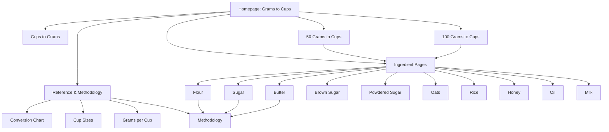
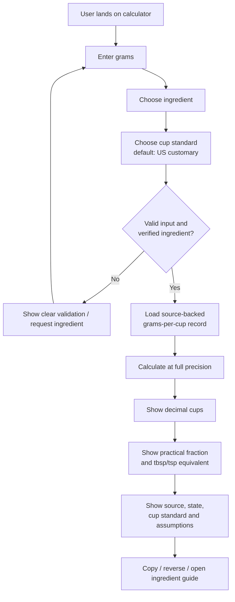

# Grams-to-Cups Tool Site: Final Research and Build Strategy

## Executive summary

**Research date: September 25, 2026.**

The Grams-to-Cups niche remains viable, but the opportunity is more specific than “make a calculator and write some SEO text.” The current search landscape rewards pages that give an **immediate numerical answer**, resolve the ambiguity created by ingredient density, and then provide enough context—ingredient selection, reference weights, charts, source notes, cup standards, and practical fractions—to make the result usable in a kitchen. Current specialist results for `50 grams to cups`, `100 grams to cups`, flour, butter, sugar, and the generic converter demonstrate that Google is willing to rank dedicated conversion sites alongside much larger calculator brands. citeturn17search0turn17search1turn17search8turn19search1

The strongest product strategy is therefore **not** to make thousands of pages for every integer from 1 g to 1,000 g. The site should launch as a small, source-transparent cooking-measurement utility built around one exceptional homepage calculator, ten substantial ingredient pages, one reverse converter, two genuinely useful amount-comparison pages (`50 grams` and `100 grams`), and several reference/methodology pages. The rule should remain:

> **One indexable page per meaningful user intent, not one page per keyword variation.**

This matters because the present SERPs contain aggressive programmatic expansion. Sites such as Cup & Gram, Grams2Cups and GramsToCups.io publish amount-specific URLs, while GramCups combines amount pages with large ingredient tables. That proves the long tail exists, but it also creates an opening to differentiate through quality rather than matching their URL count. citeturn17search0turn17search8turn17search12turn19search5

The most important technical/product decision is **data provenance**. “Grams to cups” is not a pure unit conversion for foods. A gram measures mass; a cup measures volume. Flour, sugar, oats and brown sugar do not have one immutable grams-per-cup value because preparation and measuring method change bulk density. Even reputable references disagree: King Arthur lists all-purpose flour at **120 g per cup**, while USDA's Food Buying Guide lists enriched white flour at **125 g per cup**; King Arthur lists old-fashioned/quick oats around **89 g per cup**, while USDA's Food Buying Guide gives **81 g per cup** for regular and quick rolled oats. citeturn22view0turn22view1turn22view3

That disagreement should become a **competitive advantage**, not something the site hides. Every result should be able to say, in compact form:

**100 g all-purpose flour → 0.833 US cups**  
**Reference:** 120 g/cup, King Arthur Baking  
**Method:** spoon-and-level / baking reference  
**Kitchen measure:** approximately ¾ cup + 1 tbsp + 1 tsp

That is substantially more trustworthy than presenting “0.8 cups” as if it were a physical constant.

Cup standards must also be explicit. NIST's household conversion material rounds a U.S. customary cup to about **237 mL**; FDA nutrition-labeling rules use **240 mL** as the metric equivalent of one cup; and Australian/New Zealand metric food guidance uses **250 mL** for a cup. Those are close enough that many competitors gloss over them but different enough to matter when a user expects precision. citeturn9search3turn22view2turn10search0

From a competitive-authority perspective, this niche contains two very different groups. Large generalists have enormous link profiles: current public Semrush data puts Omni Calculator around **AS 84 with roughly 31.3K referring domains**, The Calculator Site around **AS 78 with about 10K referring domains**, and Inch Calculator around **AS 80 with roughly 16.8K referring domains**. citeturn14search3turn14search5turn14search1turn14search4turn14search15 Yet the live SERPs also contain narrowly focused sites such as GramCups, GramsToCups.io, Cup & Gram, Grams2Cups, GramstoCupsConverter.cc and MeasureMint. That mixed SERP composition is precisely why a focused site can compete: it does not need to out-authority Omni across calculators generally; it needs to be materially better for **this one job**. citeturn17search0turn17search1turn18search5turn19search4

The homepage should target `grams to cups`, `grams to cups converter`, `convert grams to cups`, `g to cups`, and generic numerical use cases through **one URL: `/`**. `50 grams to cups` and `100 grams to cups` are the only amount pages I recommend at launch because current results show a recognizable cross-ingredient intent for those queries: users want to know what the same mass means for flour versus sugar versus butter, not merely see the homepage with `50` prefilled. citeturn17search0turn17search1turn17search2turn17search9

Ingredient pages should be substantial and state-aware. Flour needs measuring-method context; brown sugar needs **packed** versus loose; powdered sugar needs **sifted/unsifted** labeling; oats need an oat type; rice needs **cooked versus uncooked**; oil needs the oil type; butter benefits from sticks/tablespoons; honey benefits from tablespoons/teaspoons. Current competitors already reflect several of these distinctions, so failing to model them would make a new site less useful than the pages it is trying to displace. citeturn18search0turn20search4turn20search5turn20search6turn20search9

The recommended build sequence is:

**data model and source registry → tested conversion engine → homepage → reverse converter → ten ingredient pages → 50 g and 100 g comparison pages → reference/methodology pages → structured data/technical SEO → performance/accessibility QA → launch.**

Do **not** let Antigravity begin by generating hundreds of pages. Do **not** allow it to invent densities, silently copy competitors' numbers, make separate pages for synonyms such as `g to cups`, or create `/51-grams-to-cups/`, `/52-grams-to-cups/`, etc. The calculator engine and reference data must be trustworthy before the content system is allowed to scale.

Google's current structured-data gallery does not expose a special “calculator” rich-result type. The safe implementation is ordinary semantic HTML plus `WebSite`, `Organization`, `WebPage`, and visible `BreadcrumbList` markup as appropriate, using JSON-LD and ensuring the structured data matches visible page content. citeturn23search0turn23search9turn23search11

**Bottom-line recommendation:** build this as a **source-backed kitchen measurement product**, not an SEO page factory. The most defensible differentiation is a fast calculator that tells users not only the answer, but **which ingredient definition, cup standard, preparation state and reference produced that answer**.

Scope note: the earlier Omni organic-keyword export is background context only and is deliberately **not** being used here to reopen niche selection. fileciteturn0file0

## Current search landscape and competitor benchmark

The September 2026 SERP sample shows three recurring page types:

1. **Interactive converter pages** with an ingredient selector.
2. **Ingredient-specific converters/guides** that explain why flour, sugar, butter, etc. differ.
3. **Amount-specific comparison pages**, especially for common amounts such as 50 g and 100 g.

The user intent is overwhelmingly task-oriented: users want the answer before they want an article. The best pages put a calculator, result, or comparison table immediately near the top and then provide explanation below it. citeturn17search0turn17search1turn19search4turn19search10

Because exact Google SERP features can vary by country, account, device and experiment, I would **not** architect the site around the assumption that an AI Overview, featured snippet or People Also Ask block will always be present. What is observable across the current result set is strong **zero-click pressure**: search snippets and ranking pages frequently expose numerical answers and conversion tables directly. The product therefore needs to give searchers a reason to click—ingredient choice, source choice, cup-standard control, useful kitchen fractions, reverse conversion, and practical equivalents—rather than merely repeating a number. citeturn17search0turn17search4turn18search4

**Current intent mapping from the sampled SERPs**

| Query / cluster | Dominant intent in current results | Page types observed | What the new site should do |
|---|---|---|---|
| **grams to cups** | Generic ingredient-dependent conversion | Interactive converters, ingredient tables, explanatory guides | Homepage is the canonical destination; calculator above the fold |
| **grams to cups converter** | Same fundamental intent as `grams to cups`, with stronger tool expectation | Interactive calculator pages | Same homepage; **do not** create a second URL |
| **100 grams to cups** | “What is 100 g for different common ingredients?” plus prefilled conversion | Dedicated 100 g pages with comparative tables/calculators citeturn17search1turn17search4turn17search7turn17search8 | One handcrafted `/100-grams-to-cups/` comparison page |
| **50 grams to cups** | Same cross-ingredient comparison at 50 g | Dedicated 50 g pages, large ingredient tables citeturn17search0turn17search2turn17search5turn17search9 | One handcrafted `/50-grams-to-cups/` comparison page |
| **cups to grams** | Reverse-direction calculator | Dedicated reverse converters, sometimes USDA/source-focused tools citeturn19search0turn19search7turn19search9 | Separate `/cups-to-grams/` because direction itself is a distinct broad task |
| **flour grams to cups** | Ingredient conversion plus measuring-method clarification | Flour-specific guides/calculators; 120 g and 125 g references both visible citeturn19search1turn19search3turn18search3 | Dedicated flour page with method/source disclosure |
| **sugar grams to cups** | Granulated sugar conversion | Sugar-specific calculator/chart pages; ≈200 g/cup convention prominent citeturn19search11turn19search12 | Dedicated sugar page |
| **butter grams to cups** | Cups plus sticks/tablespoons often matter | Butter-specific tools/guides citeturn18search0turn18search1turn18search4 | Dedicated butter page with cups + sticks + tbsp/tsp |
| **brown sugar grams to cups** | Conversion depends heavily on packing state | Packed-brown-sugar guides; reference values vary citeturn20search6turn20search11 | Dedicated page; default must explicitly say **packed** |
| **powdered sugar grams to cups** | Conversion plus sifted/unsifted ambiguity | Ingredient pages typically use ≈113–120 g/cup citeturn20search0turn20search1turn20search4 | Dedicated page; state must be explicit |
| **oats grams to cups** | Oat type matters | Rolled/quick/steel-cut distinctions appear in guides citeturn20search5 | Dedicated page with type selector only where sourced |
| **rice grams to cups** | Cooked/uncooked and rice type are material distinctions | Rice-specific converters/guides, often using ≈185 g for uncooked white rice citeturn20search8turn20search9 | Dedicated page; never present “rice” without state |
| **honey grams to cups** | Dense liquid conversion, often useful in tbsp too | Honey guides commonly cluster around ≈336–340 g/cup citeturn21search0turn21search7turn21search8 | Dedicated page; include tbsp/tsp |
| **oil grams to cups** | Oil type and density matter | Olive-oil-specific conversions frequently show ≈216 g/cup citeturn21search1turn21search2turn21search3 | One oil page with oil-type selector rather than many thin pages initially |
| **milk grams to cups** | Liquid conversion, but cup definition and milk type can change result | Milk pages commonly show ≈240 g; some metric/US comparisons differ citeturn21search9turn21search10turn21search12 | Dedicated milk page with standard/source exposed |

The most important observation from that table is **intent compression**. `grams to cups`, `grams into cups`, `convert grams to cups`, `g to cups`, and `grams to cups converter` do not justify separate pages. They are variations of the same task. Conversely, `cups to grams` changes the starting unit and therefore warrants its own broad page.

The same principle applies to ingredients. `grams of flour to cups`, `flour grams to cups`, and `convert grams to cups flour` belong on **one flour page**, not three URLs.

**Competitor benchmark**

Semrush's Authority Score is a composite metric incorporating link power, estimated organic traffic and spam-related factors; it should be treated as a comparative third-party metric, not a Google metric. citeturn11search0turn14search0 Exact public AS/backlink data is not exposed for every small specialist domain, so the table deliberately says “not publicly verified” rather than inventing numbers.

| Competitor | Authority / backlink signal | Page strategy | UX/content strengths | Weaknesses and opening for us |
|---|---|---|---|---|
| **gramstocup.com** | Your earlier Semrush snapshot was roughly **AS 14** with only a few dozen referring domains; current public AS not independently refreshed | Core converter, ingredient guides, amount shortcuts, reverse conversion, printable/reference assets | Its current product includes simple conversion, batch-style functionality, ingredient guidance and source/data material; it has treated data itself as an asset. citeturn6search0turn6search2turn6search5 | Busy feature set creates room for an even clearer default journey; source values and ingredient state should be surfaced directly beside every result |
| **gramstocups.io** | Exact current public AS unavailable; specialist-site authority appears materially below the large calculator brands | Large ingredient library plus amount pages; also publishes an embeddable widget | Broad coverage, kitchen fractions, custom grams-per-cup options and an embed asset capable of earning links. citeturn13search0turn13search1 | Extensive amount-page footprint risks templated sameness; several defaults differ from primary baking references, which creates an accuracy/provenance opening |
| **gramcups.com** | Exact public AS unavailable | Ingredient guides + amount comparison pages + large ingredient database | Strong direct-answer presentation; its 50 g page compares many ingredients and explicitly discusses cup standards. citeturn17search0turn18search4 | Many answers depend on house reference values; a new site can make the provenance and preparation state more prominent |
| **cupandgram.com** | Exact public AS unavailable | Core converter, ingredient pages, highly granular amount pages, printable charts | Source-conscious methodology, ingredient-specific content, print assets. citeturn13search10turn19search1turn19search4 | Large programmatic-looking amount footprint; opportunity to compete with fewer, deeper pages and stronger source-level transparency |
| **measureminthub.com / MeasureMint** | Exact public AS unavailable; current visibility suggests a newer/smaller specialist | Amount-first conversion pages with calculator controls | Particularly good provenance UX: current 50 g/100 g pages expose ingredient, cup-standard and source choices, plus print/share features. citeturn17search1turn17search2 | Some fraction outputs are mathematically neat but not kitchen-friendly; we can outperform with practical cup+tbsp+tsp decomposition |
| **gramstocupsconverter.cc** | Exact public AS unavailable | Detailed ingredient-focused conversion guides | Good handling of flour types and ingredient-specific explanation. citeturn19search3turn18search5 | Some state-specific numbers are presented with more precision than their sourcing warrants; opportunity for a stricter source registry and confidence labels |
| **grams2cups.com** | Exact public AS unavailable | Calculator plus many amount pages and large ingredient tables | Very direct, fast route from query to answer. citeturn17search12turn17search13 | Template-heavy presentation; weaker visible differentiation around provenance and measurement assumptions |
| **TheCalculatorSite.com** | **AS ~78; ~10K referring domains; ~144.9K backlinks** in current public Semrush data citeturn14search1turn14search14 | Large general-purpose calculator/conversion publisher | Major link equity, long-lived brand, broad reference material and ingredient conversion support | Generalist rather than purpose-built; a specialist can provide cleaner kitchen workflow and deeper per-result provenance |
| **OmniCalculator.com** | **AS ~84; ~31.3K referring domains; ~492.5K backlinks** in public Semrush data citeturn14search3turn14search5 | Massive multi-category calculator platform | Strong engineering, brand recognition, internal-link network and polished calculator interaction | Generalist architecture; not optimized around a complete ingredient-source knowledge layer |
| **InchCalculator.com** | **AS ~80; ~16.8K referring domains; ~168.9K backlinks** in public Semrush data citeturn14search4turn14search15 | Broad measurement/conversion publisher | Strong measurement authority and established conversion SEO | Not narrowly centered on cooking-density ambiguity; specialist content can explain sources/methods better |
| **MetriCup** | Public AS not verified | Cups-to-grams-focused converter | Strong reverse-conversion focus, US/metric cup handling and USDA-oriented positioning. citeturn19search0 | Smaller content footprint; opportunity to cover both directions and ingredient methodology in one coherent system |

The strategic implication is important: **do not benchmark success against Omni's entire domain authority**. The relevant question is whether the new site can produce a better page than the specialist domains already ranking for the exact intent. The current results show that specialist pages continue to coexist with the AS 78–84 generalists. citeturn14search1turn14search3turn17search0turn19search4

## Measurement model and data accuracy

Accuracy is the part of this project that deserves the most engineering discipline.

A generic length converter can say:

\[
1\text{ inch}=2.54\text{ cm}
\]

and be done.

A grams-to-cups converter cannot say:

\[
1\text{ cup}=X\text{ grams}
\]

without answering **“a cup of what, measured how, and which cup?”**

For an ingredient measured empirically by mass per cup, the useful formula is:

\[
\text{cups}=\frac{\text{mass in grams}}{\text{reference grams per cup}}
\]

For a reasonably homogeneous liquid whose density is known in grams per milliliter:

\[
\text{grams per cup}=\rho_{\text{ingredient}}\times V_{\text{cup}}
\]

where \(\rho\) is density in g/mL and \(V\) is cup volume in mL.

For compressible granular ingredients such as flour, powdered sugar, oats and brown sugar, **an empirical grams-per-cup measurement is preferable to pretending that the material has one laboratory density**. King Arthur explicitly recommends weighing flour because volume measurement varies with technique and uses a practical baking reference of 120 g per cup for all-purpose flour. citeturn22view0turn22view1

**Cup standards**

| Standard | Recommended representation in the product | Evidence / implication |
|---|---:|---|
| **US customary cup** | **236.6 mL**, UI may say “≈237 mL” | NIST household tables round the cupful to approximately 237 mL. citeturn9search3 |
| **US legal / nutrition-label cup** | **240 mL** | FDA labeling guidance uses 240 mL as the metric equivalent of a cup. citeturn22view2 |
| **Metric cup** | **250 mL** | Australian/New Zealand food guidance uses 250 mL as one cup. citeturn10search0 |

The default should be **US customary** because that best matches the dominant U.S. cooking context and the measuring-cup convention implicit in many American baking references. The selector can offer “US customary,” “US legal/240 mL,” and “Metric/250 mL.”

For dry ingredients, changing cup size should be labeled an **estimated volume scaling**, not an experimentally measured new value, unless the source itself provides a value for the requested cup size.

USDA's ARS household conversion material also confirms the useful kitchen relationship of **1 cup = 16 tablespoons = 48 teaspoons**, which is valuable for translating ugly fractions into practical measures. citeturn9search7

**Recommended launch data model**

Do not store ingredients as a single dictionary like:

```text
flour = 120
sugar = 200
butter = 227
```

Store a structured record resembling:

```text
ingredient
variant
state
grams_per_reference_cup
reference_cup_ml
measurement_method
source_name
source_record_or_page
source_date_or_version
confidence
notes
```

For example:

```text
ingredient: all-purpose flour
variant: standard/unbleached
state: dry
grams_per_reference_cup: 120
reference_cup_ml: US customary
measurement_method: baking reference / spoon-and-level context
source: King Arthur Baking Ingredient Weight Chart
confidence: high
```

This allows the calculator to explain **why** it produced a result and allows a future data correction without rewriting conversion logic.

**Launch reference recommendations**

| Ingredient | Production recommendation | Confidence | Why |
|---|---:|---|---|
| **All-purpose flour** | **120 g/cup default**; disclose USDA 125 g alternative | High | King Arthur explicitly lists 120 g/cup and documents weighing technique; USDA Food Buying Guide provides 125 g for enriched white flour. citeturn22view0turn22view1turn22view3 |
| **Granulated sugar** | Use **198 g/cup** internally if following King Arthur; UI may explain that many kitchen charts round this to ≈200 g | High | King Arthur's baking chart gives a source-specific reference; current SERPs commonly simplify to 200 g. citeturn22view0turn19search12 |
| **Butter** | **≈227 g/cup** for standard butter | High | King Arthur gives 113 g per half cup; 227 g/cup is the practical whole-cup convention and matches current specialist pages closely. citeturn22view0turn18search0 |
| **Packed brown sugar** | **213 g/cup** | High | King Arthur explicitly lists packed brown sugar at 213 g/cup; some competitor defaults of 220 g illustrate why source display matters. citeturn22view0turn20search6 |
| **Powdered/confectioners' sugar** | **113 g/cup, unsifted** | High | King Arthur lists unsifted confectioners' sugar at 113 g/cup; current specialist sites often use 120 g, so preparation state must be visible. citeturn22view0turn20search0turn20search4 |
| **Rolled oats** | Prefer **89 g/cup** as the primary baking reference, but expose USDA's **81 g/cup** as an alternative/reference note | Medium-high | Reputable sources genuinely differ: King Arthur and USDA do not give the same cup weight. citeturn22view0turn22view3 |
| **Uncooked white rice** | **≈185 g/cup is provisional** | Medium until primary record is pinned | Current specialist pages repeatedly use roughly 185 g, but the production dataset should not label this “USDA verified” until the exact FoodData Central record/portion is captured. citeturn20search8turn20search9 |
| **Honey** | **≈336 g/cup** using 21 g/tbsp × 16 tbsp; explain that many charts round to ≈340 g | High-to-medium | King Arthur gives 21 g per tablespoon; USDA household relationships give 16 tbsp/cup. Current specialist pages commonly use 340 g. citeturn22view0turn9search7turn21search0 |
| **Olive/cooking oil** | **Do not lock 216 g as an unsourced universal value.** Verify each oil type in a primary food-composition record before launch | Medium / QA gate | Current specialist pages often use ≈216 g/cup, while practical baking charts can produce different rounded equivalents. Oil type matters. citeturn21search1turn21search2turn22view0 |
| **Milk** | Pin an exact USDA/FoodData Central record by milk type before production; do not call 240 g universally exact | Medium / QA gate | Current pages commonly use ~240 g, while other US/metric implementations produce different values. citeturn21search9turn21search10turn21search12 |

USDA FoodData Central is particularly useful as a primary verification layer because it is operated by USDA ARS, provides downloadable food-composition data, and its documentation explains that portion weights such as “1 cup” may be based on measured food samples and vary by data type. citeturn9search0turn9search8turn9search9

The important engineering rule is therefore:

> **Never copy a competitor's number merely because several competitors agree.**

For rice, oil and milk, Antigravity should treat the data record as **blocked for production until an exact primary-source record, portion, state and unit are documented**.

**Rounding and kitchen fractions**

The engine should calculate at full internal precision and round only for display.

Recommended display hierarchy:

**Primary:** `0.833 cups`  
**Secondary:** `≈ 5/6 cup` only if that fraction is genuinely useful  
**Practical:** `≈ 3/4 cup + 1 tbsp + 1 tsp`

In fact, practical decomposition is usually more valuable than an exotic mathematical fraction. Many kitchens have ¼, ⅓, ½ and 1-cup measures—not a 5/6-cup measure.

Use a whitelist of familiar fractions such as:

`1/8, 1/4, 1/3, 3/8, 1/2, 5/8, 2/3, 3/4, 7/8`

and fall back to tablespoons/teaspoons when the nearest fraction introduces too much error.

The result should always preserve the decimal so that the UI never disguises approximation.

For grams, a sensible display policy is:

- at or above about 10 g: nearest whole gram unless the source itself warrants greater precision;
- below 10 g: one decimal where useful;
- never calculate reverse conversions from already-rounded display values.

**Edge cases**

The engine should accept zero and return zero. It should reject negative food quantities, `NaN`, infinity and malformed strings. It should safely parse decimal input, and the reverse converter can optionally parse common fractions such as `1/2` and mixed input such as `1 1/2`.

An ingredient must be selected before the site claims a generic grams-to-cups answer. If the ingredient is unknown, the correct behavior is **“choose an ingredient or enter a custom grams-per-cup value,” not a guessed conversion**.

Rice must force or clearly default a state such as “uncooked white rice.” Brown sugar must say “packed” if the 213 g reference is used. Powdered sugar must say “unsifted” if the 113 g reference is used. Oats should specify rolled/quick/etc. Butter should define whether the reference is ordinary solid butter. These qualifiers are part of the number, not optional copy. citeturn20search4turn20search5turn20search6turn20search9

## Keyword architecture and site structure

The information architecture should deliberately resist keyword multiplication.

The homepage is the **generic conversion entity**. It should rank for:

`grams to cups`  
`grams to cups converter`  
`convert grams to cups`  
`grams into cups`  
`g to cups`  
`grams in cups`  
`how many cups is X grams`

All of those should resolve conceptually to **one page**.

The reverse direction deserves `/cups-to-grams/` because current results support a distinct task and dedicated reverse-converter pages. citeturn19search0turn19search7

Each ingredient receives one canonical page that supports **both directions within the interface**, while the page's primary SEO orientation remains ingredient grams-to-cups. Do not immediately create both:

`/grams-to-cups/flour/`

and

`/cups-to-grams/flour/`

because the same ingredient calculator can satisfy both. Split later only if Search Console and a fresh SERP audit demonstrate materially distinct intent.

The recommended canonical patterns are:

```text
/                                  → generic Grams to Cups
/cups-to-grams/                    → generic reverse converter

/grams-to-cups/flour/
/grams-to-cups/sugar/
/grams-to-cups/butter/
/grams-to-cups/brown-sugar/
/grams-to-cups/powdered-sugar/
/grams-to-cups/oats/
/grams-to-cups/rice/
/grams-to-cups/honey/
/grams-to-cups/oil/
/grams-to-cups/milk/

/50-grams-to-cups/
/100-grams-to-cups/

/grams-per-cup/
/cup-sizes/
/conversion-chart/
/methodology/
```

There should **not** be a duplicate `/grams-to-cups/` page if the homepage already fulfills that intent. Either never create it or permanently redirect it to `/`.

Google treats canonical declarations as signals for selecting representative URLs among duplicate or near-duplicate pages, not as a substitute for clean URL architecture. Query-state URLs should therefore canonicalize to the clean page and should not appear in the sitemap. citeturn23search12

For example:

```text
/?grams=100&ingredient=flour
/?ingredient=sugar&cup=metric
/grams-to-cups/flour/?grams=250
```

may exist as shareable calculator state if useful, but they should **not become additional indexable SEO pages**.

A sensible structure is:



The homepage interaction should be equally uncomplicated:



**Title templates**

Homepage:

> **Grams to Cups Converter by Ingredient | [Brand]**

Reverse:

> **Cups to Grams Converter by Ingredient | [Brand]**

Ingredient:

> **{Ingredient} Grams to Cups Converter & Chart | [Brand]**

Amount:

> **{Amount} Grams to Cups: Flour, Sugar, Butter & More | [Brand]**

Reference:

> **Grams per Cup Chart by Ingredient | [Brand]**

Titles should describe the actual page rather than mechanically stuffing every synonym. Meta descriptions should explain the differentiator—ingredient dependence, source-backed values and practical measurements—not repeat the title.

The **50 g and 100 g pages are intentional exceptions** to the no-amount-pages rule. Current search results repeatedly return purpose-built 50 g and 100 g pages from several domains, and their useful form is a cross-ingredient comparison rather than a one-number doorway page. citeturn17search0turn17search1turn17search2turn17search4

Do not infer from that that `51 g`, `52 g`, `53 g` and every other amount should be indexed. They should remain calculator states unless future Search Console evidence shows a genuinely valuable content pattern.

## Launch content plan

The recommended launch is **23 pages**. That is large enough to establish topical depth but small enough that every page can be manually reviewed.

The meta descriptions below are deliberately written in roughly the requested **150–200 character range** rather than generated as tiny variants.

| URL | H1 | Meta description | Primary target | Page purpose |
|---|---|---|---|---|
| `/` | **Grams to Cups Converter** | Convert grams to cups by ingredient using source-backed weights for flour, sugar, butter and more. Get decimal cups, kitchen fractions, cup standards, and practical measuring equivalents. | grams to cups; grams to cups converter; g to cups | Main product and strongest SEO page |
| `/cups-to-grams/` | **Cups to Grams Converter** | Convert cups to grams by ingredient with source-backed cup weights. Choose US customary or metric cups and get precise gram results for flour, sugar, butter, oats, rice, honey, oil, and milk. | cups to grams; cups to grams converter | Capture reverse-direction intent without duplicating homepage |
| `/grams-to-cups/flour/` | **Flour Grams to Cups Converter** | Convert flour grams to cups with a source-backed flour weight, practical kitchen fractions, and a clear measuring method. Compare common references and see a quick grams-to-cups chart. | flour grams to cups; grams of flour to cups | Explain 120 vs 125 g references and measuring method |
| `/grams-to-cups/sugar/` | **Sugar Grams to Cups Converter** | Convert granulated sugar from grams to cups with source-backed cup weights, decimal and kitchen-fraction results, and a quick chart for common baking amounts. | sugar grams to cups | Granulated-sugar calculator and chart |
| `/grams-to-cups/butter/` | **Butter Grams to Cups Converter** | Convert butter grams to cups, sticks, tablespoons, and teaspoons with source-backed weights. Get practical baking equivalents and a quick chart for common butter amounts. | butter grams to cups | Add sticks/tbsp/tsp utility beyond plain cups |
| `/grams-to-cups/brown-sugar/` | **Brown Sugar Grams to Cups Converter** | Convert packed brown sugar from grams to cups with a clearly stated packing method and source-backed weight. See decimals, useful fractions, and common conversion amounts. | brown sugar grams to cups | Treat packing state explicitly |
| `/grams-to-cups/powdered-sugar/` | **Powdered Sugar Grams to Cups Converter** | Convert powdered sugar grams to cups using a clearly stated unsifted reference weight. See practical fractions, source notes, and a quick chart for common baking amounts. | powdered sugar grams to cups | Handle unsifted/sifted ambiguity honestly |
| `/grams-to-cups/oats/` | **Oats Grams to Cups Converter** | Convert oats from grams to cups with the oat type and reference source made explicit. Compare common rolled-oat references and get practical fractions for recipe use. | oats grams to cups | Explain oat-type and source differences |
| `/grams-to-cups/rice/` | **Rice Grams to Cups Converter** | Convert rice grams to cups with uncooked or cooked state clearly identified. See practical cup equivalents, source notes, and a chart for common recipe quantities. | rice grams to cups | Prevent cooked/uncooked ambiguity |
| `/grams-to-cups/honey/` | **Honey Grams to Cups Converter** | Convert honey grams to cups, tablespoons, and teaspoons with a source-backed reference weight. Get practical kitchen equivalents and a quick chart for common amounts. | honey grams to cups | Dense-liquid conversion plus spoon measures |
| `/grams-to-cups/oil/` | **Oil Grams to Cups Converter** | Convert cooking oil grams to cups by oil type, with the selected reference source and cup standard shown. Get decimal cups, useful fractions, and tablespoon equivalents. | oil grams to cups; olive oil grams to cups | One substantial oil page instead of many thin oil URLs |
| `/grams-to-cups/milk/` | **Milk Grams to Cups Converter** | Convert milk grams to cups with the milk type, cup standard, and reference source made clear. Get decimal cups, practical fractions, and common kitchen equivalents. | milk grams to cups | Liquid conversion with cup/type transparency |
| `/50-grams-to-cups/` | **50 Grams to Cups by Ingredient** | See how many cups 50 grams equals for flour, sugar, butter, oats, rice, honey, oil, milk, and more. Compare ingredients in one table and open the calculator for precise results. | 50 grams to cups; 50g to cups | Cross-ingredient comparison, not a doorway page |
| `/100-grams-to-cups/` | **100 Grams to Cups by Ingredient** | See how many cups 100 grams equals for flour, sugar, butter, oats, rice, honey, oil, milk, and more. Compare ingredients at a glance and calculate with your chosen cup standard. | 100 grams to cups; 100g to cups | High-value cross-ingredient comparison |
| `/grams-per-cup/` | **Grams per Cup by Ingredient** | Compare grams per cup for common baking and cooking ingredients, with the cup standard, preparation method, and source shown so you can understand why reference values differ. | grams per cup; grams in a cup chart | Master reference/data page and linkable asset |
| `/cup-sizes/` | **US vs Metric Cup Sizes Explained** | Understand US customary, US legal, and metric cup sizes, how their milliliter values differ, and when cup choice changes a grams-to-cups conversion in real recipes. | US cup ml; metric cup ml; cup sizes | Explain 236.6/240/250 mL issue |
| `/conversion-chart/` | **Grams to Cups Conversion Chart** | Print or save a grams-to-cups conversion chart for common ingredients, with practical kitchen fractions, grams-per-cup references, cup standards, and source notes. | grams to cups chart; conversion chart | Printable/shareable reference asset |
| `/methodology/` | **How Our Grams-to-Cups Conversions Are Calculated** | See how our grams-to-cups calculator chooses ingredient weights, cup standards, sources, rounding rules, and kitchen fractions, including how we handle conflicting references. | grams to cups formula; methodology | Trust, provenance and source hierarchy |
| `/how-to-measure-flour/` | **How to Measure Flour Accurately** | Learn why flour weight varies by measuring method, how spoon-and-level differs from scooping, and how using a kitchen scale improves repeatability in grams-to-cups conversions. | how to measure flour; flour cup weight | Supporting educational/link-worthy page |
| `/about/` | **About [Brand]** | Learn why this grams-to-cups tool exists, how its conversion data is researched and reviewed, and the principles we use for accuracy, transparency, speed, and useful kitchen results. | branded | Establish editorial responsibility and trust |
| `/contact/` | **Contact [Brand]** | Contact the team to report a conversion issue, suggest an ingredient, question a source, or share feedback about the grams-to-cups calculator and its supporting guides. | branded | Corrections and user feedback channel |
| `/privacy/` | **Privacy Policy** | Read how this grams-to-cups site handles analytics, cookies, advertising, and personal information, including what data may be collected and the choices available to visitors. | none | Privacy/legal requirement |
| `/terms/` | **Terms of Use** | Review the terms for using this grams-to-cups website, including informational-use limits, calculation assumptions, intellectual property, external links, and service availability. | none | Legal boundaries and informational-use statement |

The ingredient pages should not be 1,500 words of filler around the same calculator. Each should earn its existence through **ingredient-specific information**.

For example, the butter page should discuss sticks and tablespoons because those are useful butter measurements. The rice page should distinguish uncooked from cooked rice. The flour page should explain measurement technique. Brown sugar should address packing. Oats should address type. Current competitor pages already signal that users encounter these ambiguities. citeturn18search0turn19search1turn20search5turn20search6turn20search9

A strong ingredient page can use this repeatable structure without becoming templated:

**H1 → calculator → answer explanation → source/reference card → practical conversion table → ingredient-specific measurement issue → common quantities → reverse conversion → related ingredient links → methodology/source links.**

The component structure may repeat. The **substantive content and measurement assumptions may not**.

## Technical SEO, UX, differentiation and monetization

**Rendering and crawlability**

The essential page—H1, calculator labels, default explanatory content, conversion table, source information and major internal links—should be present in server-rendered/static HTML. Client-side JavaScript can make the calculator interactive, but the page should not become an empty shell if JavaScript is delayed.

Google's technical minimum is straightforward: Googlebot must not be blocked, the page must return a successful HTTP response, and it must contain indexable content. Google predominantly crawls with its smartphone crawler, so mobile behavior is not secondary QA. citeturn24search13turn24search4

**Canonical and URL rules**

Every intended indexable page should have a self-referencing canonical.

Enforce one protocol/host/slash policy, for example:

```text
https://example.com/grams-to-cups/flour/
```

and permanently redirect alternative HTTP, `www`/non-`www`, capitalization and slash variants.

Calculator-state query parameters should canonicalize to the base page:

```text
/?grams=100&ingredient=flour
        canonical → /

/grams-to-cups/flour/?grams=250
        canonical → /grams-to-cups/flour/
```

Do not put parameter states in the sitemap. Google's canonical guidance recommends consistent signals around the preferred representative URL. citeturn23search12

**Sitemap and robots**

Generate an XML sitemap containing only canonical, indexable, successful URLs and reference it from `robots.txt`. Google states that sitemap submission is a discovery hint rather than a guarantee of indexing. citeturn23search2

A simple production `robots.txt` can conceptually be:

```text
User-agent: *
Allow: /

Sitemap: https://example.com/sitemap.xml
```

Do not attempt to `noindex` pages through `robots.txt`: Google's documentation states that robots rules control crawling, while `noindex` needs to be discoverable on a crawlable page to be processed. citeturn24search0turn24search2turn24search5

Staging environments should be protected from public indexing. Before launch, explicitly verify that staging-level `noindex` or authentication rules have not leaked into production.

**Structured data**

Google recommends JSON-LD where practical and requires structured data to represent content actually visible to users. citeturn23search0

Use:

- `WebSite` at the site level.
- `Organization` for the publisher.
- `WebPage` on calculators/guides.
- `BreadcrumbList` where a visible breadcrumb exists. citeturn23search11

There is currently **no dedicated “calculator” rich-result type** in Google's Search Gallery, so do not invent `"@type": "Calculator"` or misuse `MathSolver`. citeturn23search9

Do not mark ingredient conversion pages as `Recipe` unless they actually contain a recipe. Do not add schema solely because an AI agent claims “more schema is better.”

A future public density/reference dataset could potentially use `Dataset` markup **only if it truly behaves like a documented dataset** with provenance, fields, license and downloadable data—not just because there is a table on the page.

**Core Web Vitals and mobile UX**

Target Google's “good” Core Web Vitals range at the 75th percentile:

- **LCP:** ≤ 2.5 seconds
- **INP:** ≤ 200 milliseconds
- **CLS:** ≤ 0.1

Web.dev documents the current Core Web Vitals assessment approach, including the 75th-percentile criterion; its CLS guidance identifies ≤0.1 as the good range. citeturn24search9turn24search12

For this site, achieving those thresholds should be easier than on a content-heavy publication because the product does not need a large JavaScript application.

Practical requirements:

The calculator must fit comfortably at roughly 360 px mobile width. Inputs need proper numeric keyboards where appropriate. Ingredient selection should be searchable without downloading a giant third-party UI library. The result area must reserve enough height that calculating does not shift the entire page. Any future advertisements should have reserved slots to prevent CLS.

The calculator should work entirely from local data after page load. There is no reason to make a network request every time the user types `100`.

Accessibility requirements should include visible labels, keyboard operation, meaningful focus states, sufficient contrast, screen-reader-friendly form errors and an `aria-live` result announcement. Never rely only on color to communicate selected cup standard or validation state.

**Internal linking**

The homepage should link prominently to all ten launch ingredient pages, `cups-to-grams`, the two amount pages and the reference chart.

Every ingredient page should link to:

`homepage → reverse converter → methodology → grams-per-cup reference → 2–4 genuinely related ingredients`

The 50 g and 100 g tables should make ingredient names links to their ingredient guides.

`/grams-per-cup/` should act as a strong internal hub linking every ingredient row to its detailed page.

`/methodology/` should be linked wherever a source/assumption is exposed, preferably through a compact **“How this is calculated”** link.

This creates a semantic network based on user tasks rather than a footer containing hundreds of keyword links.

**The strongest differentiation opportunities**

The competitors have already taken many obvious features. GramstoCups.io has an embeddable widget, GramstoCup.com has downloadable/reference data, and Cup & Gram offers printable chart material. Merely copying those features is not enough. citeturn13search1turn6search0turn13search10

The more defensible opportunities are:

**Per-result provenance.** Every result should have a small source card:

> Reference: 120 g/cup  
> Ingredient: all-purpose flour  
> State: dry  
> Method/reference: King Arthur Baking  
> Cup: US customary  
> Last reviewed: [date]

Most calculators put sources somewhere below the article. Make provenance part of the **result itself**.

**“Why do calculators disagree?” functionality.** For flour, oats, powdered sugar and similar ingredients, allow a user to inspect alternative recognized references. King Arthur versus USDA differences are factual and useful, not filler. citeturn22view0turn22view3

For example:

> **Our default:** 120 g/cup — King Arthur Baking  
> **USDA reference:** 125 g/cup — USDA Food Buying Guide  
> 100 g therefore equals 0.833 cups or 0.800 cups depending on the chosen reference.

That is an unusually strong trust feature.

**Practical measure decomposition.** Rather than returning:

> 0.833 cups ≈ 5/6 cup

return:

> **0.833 cup**  
> **Kitchen measure:** approximately **¾ cup + 1 tbsp + 1 tsp**

This solves the user's real problem.

**Cup standard transparency.** Display the actual volume next to the selector:

> US customary — 236.6 mL  
> US legal — 240 mL  
> Metric — 250 mL

Current references confirm that those standards are not identical. citeturn9search3turn22view2turn10search0

**Ingredient state as first-class data.** Do not hide `packed`, `unsifted`, `uncooked`, etc. in a paragraph after the result. Put it next to the selector and answer.

**Custom grams-per-cup override.** A baker with a package or recipe specifying a different reference should be able to enter it. This is especially valuable for flour brands and specialty ingredients. Because at least one current competitor already offers custom references, this should be considered a baseline advanced feature rather than a unique selling point. citeturn13search0

**Shareable state without index bloat.** “Copy link” can produce:

```text
/?grams=100&ingredient=flour&cup=us
```

for the user while canonicalizing it to `/`. That gives product utility without SEO duplication.

**Fast, calm design.** A focused site can beat general-purpose calculator brands through speed and reduced visual clutter even when it cannot match their authority.

**Source correction workflow.** Put “Report a data issue” beside source information. A correction can then update the central ingredient record and every dependent page automatically.

**Monetization**

Display advertising is the most obvious eventual monetization route, but ads should be introduced **after** the primary product and content are established rather than designing the first release around ad density.

The safest UX placement is after the calculator/result and between substantial content sections—not between an input and its answer. Reserve dimensions for future ad units so adding monetization does not destabilize layout.

Contextual affiliate opportunities include:

- digital kitchen scales;
- measuring cups/spoons;
- baking tools;
- ingredient-specific equipment where genuinely relevant.

Affiliate material should be secondary to the answer and clearly disclosed.

A downloadable printable chart can be a retention/link asset. A clean embed widget can eventually support link acquisition, although GramstoCups.io already uses this tactic, so ours would need better source attribution or customization rather than being a clone. citeturn13search1

A more interesting long-term asset is a **public, documented ingredient-measurement dataset** with source provenance and change history, provided licensing permits redistribution. That can attract links from bloggers and developers while strengthening the site's claim to be a reference resource rather than a page generator.

## Build order and pre-handoff QA

Antigravity should **not** start by writing articles.

It should start by making the data and calculation layer correct.

**Recommended build sequence**

| Phase | What Antigravity should build | Acceptance condition before moving on |
|---|---|---|
| **Data foundation** | Ingredient schema, source registry, cup-standard definitions, preparation states | Every launch ingredient has an explicit source/state; rice, oil and milk remain flagged until primary references are pinned |
| **Conversion engine** | Grams→cups, cups→grams, cup-standard handling, fractions, tbsp/tsp decomposition, validation | Unit tests pass for all verified reference fixtures and reverse conversions |
| **Core calculator component** | Reusable accessible calculator with source card | Works keyboard/mobile, displays decimal + practical measure + assumptions |
| **Homepage** | Server-rendered core page and calculator | Generic keywords all map to this single canonical URL |
| **Reverse converter** | `/cups-to-grams/` using the same engine | No duplicated data/formulas; direction changes only the interface/calculation |
| **Ingredient system** | Ten substantial ingredient pages from structured data plus ingredient-specific editorial blocks | No page is merely another ingredient name inserted into identical prose |
| **Amount pages** | Only `/50-grams-to-cups/` and `/100-grams-to-cups/` | Each contains a meaningful cross-ingredient table and calculator, not a prefilled doorway |
| **Reference layer** | Grams-per-cup table, cup-size guide, chart, methodology, flour measurement guide | Every important numeric assumption can be traced to a reference |
| **Technical SEO** | Canonicals, metadata, sitemap, robots, structured data, redirects | Crawl test shows only intended canonical URLs |
| **Performance/accessibility** | Mobile optimization, keyboard/screen-reader QA, CWV optimization | No major accessibility failures; field data target architecture is comfortably within CWV thresholds |
| **Trust/launch** | About, contact, privacy, terms, analytics/Search Console | Production is indexable, tracking works, no staging rules remain |

**Data and calculation QA**

| Check | Required outcome |
|---|---|
| Flour fixture | 120 g with 120 g/cup reference = exactly 1 cup |
| Reverse identity | Converting `x grams → cups → grams` returns `x` before display rounding |
| Brown sugar | Result explicitly says **packed** when using 213 g/cup |
| Powdered sugar | Result explicitly says **unsifted** when using the 113 g reference |
| Rice | No result can ambiguously say simply “rice” if the dataset distinguishes cooked/uncooked |
| Oil | Oil type is shown; no universal oil density is silently assumed |
| Cup standard | UI visibly shows selected mL standard |
| Source | Every production ingredient record has publisher, reference and review status |
| Alternate references | Differences are displayed as alternatives, not averaged into an invented “truth” |
| Negative input | Rejected |
| Zero | Returns zero cleanly |
| Invalid / infinite input | Rejected without crashing |
| Large input | Does not overflow, freeze or produce scientific-notation nonsense for normal kitchen use |
| Rounding | Internal calculations retain precision; display rounding never feeds a subsequent calculation |
| Fractions | Output uses practical kitchen fractions or tbsp/tsp rather than arbitrary denominator fractions |

**SEO QA**

| Check | Required outcome |
|---|---|
| Homepage canonical | Exactly one canonical generic grams-to-cups page |
| `/grams-to-cups/` duplicate | Does not exist separately; redirect to `/` if requested |
| Synonym URLs | No separate pages for `g-to-cups`, `convert-grams-to-cups`, etc. |
| Query parameters | Shareable if desired, but canonical to clean URL and absent from sitemap |
| Ingredient pages | One canonical URL per ingredient intent |
| Amount pages | Only manually approved amount pages are indexable |
| HTTP status | Every sitemap URL returns `200` |
| Redirects | HTTP/host/slash/case variants consolidate consistently |
| Sitemap | Contains canonical production pages only |
| robots.txt | Does not block pages that need indexing |
| Staging rules | No accidental production `noindex`, authentication or crawler block |
| Title/H1 | Unique and aligned with page purpose |
| Meta description | Unique and useful, not generated keyword permutations |
| Internal links | No orphan ingredient or reference pages |
| Structured data | Valid JSON-LD and matches visible page content |
| Breadcrumbs | Visible and marked up only where logically applicable |
| 404 | Genuine missing URLs return a useful 404, not a soft-404 calculator page |

Google's own documentation emphasizes that robots controls crawling rather than serving as a noindex mechanism, while sitemaps and canonical tags are signals rather than guarantees; these checks therefore need to be validated on the deployed site rather than assumed correct because Antigravity generated the files. citeturn23search2turn23search12turn24search0turn24search2

**Mobile, UX and performance QA**

Test at minimum narrow mobile, ordinary mobile, tablet and desktop widths.

The first viewport on mobile should expose:

> H1  
> one-sentence explanation  
> grams input  
> ingredient control  
> cup standard  
> result

A user should not need to scroll through an introduction before using the tool.

Calculator updates should not move the page unpredictably. Reserve result-area height. Test input with on-screen keyboards. Make select menus usable with touch. Ensure no sticky ad/header covers controls. Copy/share functionality must not require an account.

Validate LCP, INP and CLS in PageSpeed/Lighthouse during development and then monitor real-user data after launch; the current good-range targets remain LCP ≤2.5 s, INP ≤200 ms and CLS ≤0.1 at the 75th percentile. citeturn24search9turn24search12

**Content QA**

Every numerical statement must trace to either:

1. a primary/official source,
2. a clearly named established baking reference, or
3. an explicitly labeled calculated/derived value.

There should be no phrases such as “the exact conversion is...” for an ingredient whose bulk measurement varies.

Review every page for contradictions between the calculator, table, examples and prose. The data table—not handwritten prose—should generate repeated numerical examples where possible so a future data correction cannot leave conflicting numbers across the site.

Add a visible “last reviewed” date to methodology/reference data, but do not mechanically change dates merely to create apparent freshness.

**What Antigravity must explicitly avoid**

Do **not** ask an agent to “generate all possible grams-to-cups SEO pages.”

Do **not** create:

```text
/1-gram-to-cups/
/2-grams-to-cups/
/3-grams-to-cups/
...
/999-grams-to-cups/
```

Do **not** create separate indexable pages for:

```text
grams to cups
grams into cups
g to cups
convert grams to cups
grams to cups converter
```

Do **not** create dozens of near-identical ingredient pages before their reference data is verified.

Do **not** copy competitor density tables without verifying their original source.

Do **not** silently treat 240 mL, 236.6 mL and 250 mL as the same cup. NIST, FDA and metric food guidance demonstrate that those conventions differ. citeturn9search3turn22view2turn10search0

Do **not** label rice, oil or milk data as “USDA verified” until the exact FoodData Central item/portion record has actually been captured. FoodData Central has a formal data/portion structure; the source must be identifiable, not merely name-dropped. citeturn9search0turn9search9

Do **not** invent calculator schema; Google currently lists supported search appearance types and does not provide a generic calculator rich-result type. citeturn23search9

Do **not** let advertising interrupt input → result interaction.

Do **not** let one AI agent rewrite the data model casually after pages have been generated. The data schema, formula rules, rounding rules and URL policy should become explicit project constraints before page implementation.

The final specification Antigravity should work from is therefore simple:

> **Build the reference system first, the calculation engine second, and the SEO pages third.**

A new Grams-to-Cups site is unlikely to beat established competitors merely by publishing more URLs. Its realistic competitive advantage is to be **faster, clearer, more practical and more transparent about why the answer is what it is**—especially where reliable sources themselves disagree. Current SERPs already prove that specialist sites can participate in this market, while the King Arthur/USDA discrepancies prove that a genuinely source-aware product has room to be materially better than a generic “grams ÷ number = cups” calculator. citeturn17search0turn19search4turn22view0turn22view3